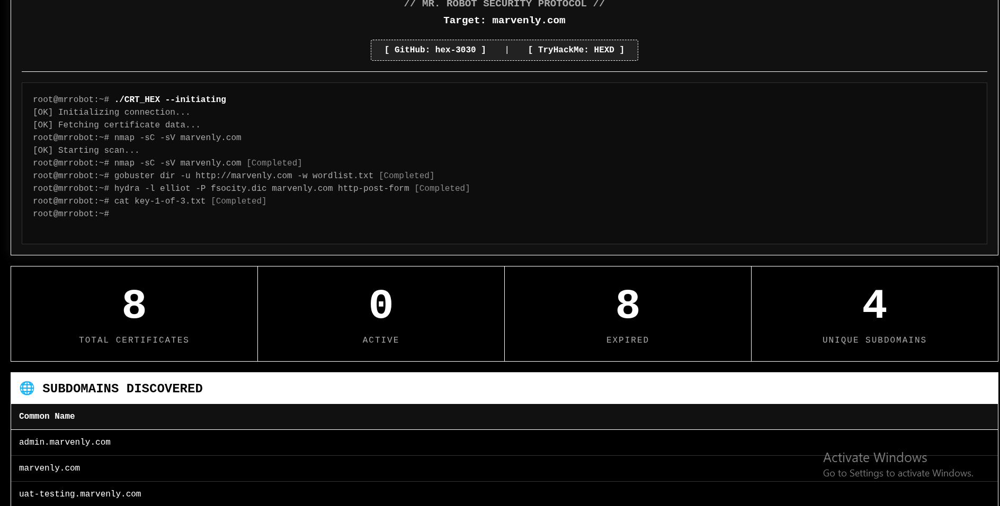

<p align="center">
  
  
  
</p>

<h1 align="center">🔐 CRT_HEX - Mr. Robot Edition</h1>

<p align="center">
  <b>"Hello, friend."</b> — A powerful SSL certificate reconnaissance and subdomain discovery tool, themed after the Mr. Robot series and TryHackMe room.
</p>

---

## 🚀 Features

- ⚡ **Live certificate enumeration** using `crt.sh`.
- 🌐 **Fully separated** list of unique subdomains from certificates.
- 🚨 **Duplicate subdomain detection** (identifies frequently repeated hosts).
- 🎨 **Full-screen HTML output** with the Mr. Robot theme (live typing terminal, black & white).
- 🖥️ **Beautiful terminal output** with a hacker-style color palette.
- 📁 Export results to **HTML** and **TXT** formats.

## 📸 Preview

**

## 📥 Installation

```bash
git clone https://github.com/hex-3030/CRT_HEX.git
cd CRT_HEX
chmod +x CRT_HEX-V1.0.sh
